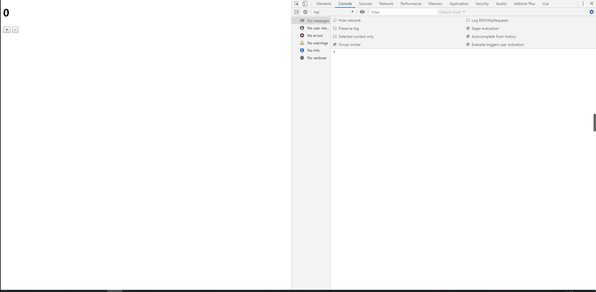

## VueX学习

### 使用vue-cli创建vue项目

```bash
# 全局安装脚手架
npm install -g @vue/cli-init
# 初始化项目
vue init webpack-simple my-project
# 安装vuex依赖
npm install vuex
```

### 修改main.js

我们需要引入vuex

```javascript
import Vuex from 'vuex'

// 让Vuex生效
Vue.use(Vuex)
```

然后创建一个全局的store，用于状态的存储

```javascript
const store = new Vuex.Store({
  // 全局状态
  state: {
    count: 0
  },
  // getters是对数据的包装，例如对数据进行拼接，或者过滤
  getters: {
    //类似于计算属性
    myCount(state) {
      return `current count is ${state.count}`
    }
  },
  // 如果我们需要更改store中的状态，一定要通过mutations来进行操作
  mutations: {
    // 增加的方法
    increment(state) {
      state.count += 1
    },
    // 减少的方法
    decrement(state) {
      state.count -= 1
    }
  },
  // actions是我们定义的一些操作，正常情况下，我们很少会直接调用mutation方法来改变state
  actions: {
    // 编写业务代码
    myIncrement: function(context) {
      // 进行一系列的操作，比如从后台取数据等
      context.commit('increment')
    },
    myDecrement: function(context) {
      // 进行一系列的操作，比如从后台取数据等
      context.commit("decrement")
    }
  }
})
```

从创建的store可以看到，里面包含了四部分内容：state，getters，mutations，actions

- stat是全局状态，也就是我们需要存储的内容
- getters：就是我们的get方法，相当于java里面的get set一样，我们可以通过在getter里面编写代码，完成一些数据的包装：例如数据拼接和数据的过滤
- mutations：英文意思是变换的意思，这里我们可以把它看成是methods，在里面编写方法，用来操作state中的值进行变化，比如这里我们有两个方法，increment和decrement，分别对应的增加和减少的方法，里面的方法需要传入一个state，我们通过state.count在对数值进行改变
- actions：是用来存在一些动作，正常情况下，我们很少会直接调用mutation方法来改变state

然后我们还需要将state和vue实例关联起来

```javascript
new Vue({
  el: '#app',
  render: h => h(App),
  //需要将store和vue实例进行关联，这里将其传递进去
  store
})
```

完整的main.js代码如下所示：

```javascript
import Vue from 'vue'
import App from './App.vue'
import Vuex from 'vuex'

// 让Vuex生效
Vue.use(Vuex)

const store = new Vuex.Store({
  // 全局状态
  state: {
    count: 0
  },
  // getters是对数据的包装，例如对数据进行拼接，或者过滤
  getters: {
    //类似于计算属性
    myCount(state) {
      return `current count is ${state.count}`
    }
  },
  // 如果我们需要更改store中的状态，一定要通过mutations来进行操作
  mutations: {
    // 增加的方法
    increment(state) {
      state.count += 1
    },
    // 减少的方法
    decrement(state) {
      state.count -= 1
    }
  },
  // actions是我们定义的一些操作，正常情况下，我们很少会直接调用mutation方法来改变state
  actions: {
    // 编写业务代码
    myIncrement: function(context) {
      // 进行一系列的操作，比如从后台取数据等
      context.commit('increment')
    },
    myDecrement: function(context) {
      // 进行一系列的操作，比如从后台取数据等
      context.commit("decrement")
    }
  }
})

new Vue({
  el: '#app',
  render: h => h(App),
  //需要将store和vue实例进行关联，这里将其传递进去
  store
})
```

### 修改App.vue页面

在vue页面中vuex

```
 import {mapState, mapGetters, mapMutations, mapActions} from 'vuex';
```

mapState 和 mapMutations 就相当于把刚刚我们在main.js页面中创建的store里面的state、mutations、actions都传递过来了，我们只需要通过...进行解析后，就可以直接使用

首先我们需要在计算属性中，将mapState中的count拿出来

```javascript
  computed: {
    // 在计算属性下，我们通过mapState(['count'])获取的是数组，然后通过...解析
    ...mapState(['count']),
    ...mapGetters(['myCount'])
  },
```

1）然后我们在methods中，将mapMutations中的increment和decrement方法解析出来

```javascript
//拿到vuex中的写的两个方法
...mapMutations(["increment", "decrement"]),
```

2）或者我们也可以，通过 this.$store.commit("increment"); 调用increment方法和decrement方法

```javascript
  methods: {
    incrementClick: function() {
      // 通过store，来调用increment
      this.$store.commit("increment");
    },
    decrementClick: function() {
      this.$store.commit("decrement");
    },
  }
```

上述所说的1和2都是一样的效果，我们只需要使用一种即可。

但是在正常的开发中，我们很少直接操作mutations，而是通过actions来完成的

我们也是通过在methods中对store中的actions进行解析

```javascript
// 难道vuex中actions写的两个自定义方法
...mapActions(['myIncrement', "myDecrement"]),
```

然后通过方法来调用

```
    methods: {
      // 难道vuex中actions写的两个自定义方法
      ...mapActions(['myIncrement', "myDecrement"]),
      incrementClick: function () {
        this.myIncrement();

      },
      decrementClick: function () {
        this.myDecrement();
      },
    }
```

最终的代码实现如下：

```vue
<template>
  <div id="app">
    <h1>{{count}}</h1>
    <h1>{{myCount}}</h1>
    <button @click="incrementClick">+</button>
    <button @click="decrementClick">-</button>
  </div>
</template>

<script>

  // vuex中有mapState方法，相当于我们能够使用它的getset方法
  import {mapState, mapMutations, mapActions} from 'vuex';

  export default {
    name: 'app',
    data() {
      return {
        msg: 'Welcome to Your Vue.js App'
      }
    },
    computed: {
      // 在计算属性下，我们通过mapState(['count'])获取的是数组，然后通过...解析
      ...mapState(['count'])
    },
    methods: {

      //拿到vuex中的写的两个方法
      ...mapMutations(["increment", "decrement"]),
      // 难道vuex中actions写的两个自定义方法
      ...mapActions(['myIncrement', "myDecrement"]),
      incrementClick: function () {
        // 通过store，来调用increment
        //this.$store.commit("increment");
        this.myIncrement();
      },
      decrementClick: function () {
        //this.$store.commit("decrement");

        this.myDecrement();

      },
    }
  }
</script>

<style>

</style>

```

### 运行的结果

在这之前，我推荐一个vue的chrome 插件，它能够让我们看到我们操作state时候的数据变化


安装完成后，重启浏览器，然后F12后，能在调试页面就能够看到vue这个选项卡了，下面看demo运行的结果：



### 小结

- 关于mutations和actions里面的方法是如何编写的，或者说什么时候应该编写mutation中的函数，什么时候应该编写action中的函数？


一般来说，我们是将简单的一些操作state数值的函数，写在mutations中，然后把一些复杂的业务逻辑写在actions中，如果在actions中我们需要改变state，那就通过传入的context调用mutation中的方法来实现状态的改变。

- 关于一些页面相关的操作，我们不要放到action来，而是尽量是逻辑相关的


### mutations和actions自定义传参

有的时候，我们需要从页面自定义传递一些参数过来，这个时候，我们的mutations和actions就需要接受额外的参数了，这也是可以的

首先我们先看main.js中mutations和actions如何编写

首先是mutations：

```javascript
  // 如果我们需要更改store中的状态，一定要通过mutations来进行操作
  mutations: {
    // 增加的方法
    increment(state) {
      state.count += 1
    },
    // 减少的方法
    decrement(state) {
      state.count -= 1
    },
    // 传入自定义参数
    incrementN(state, N) {
      state.count += N
    }
  },
```

然后我们在编写mutations：同样也增加一个参数N

```javascript
  // actions是我们定义的一些操作，正常情况下，我们很少会直接调用mutation方法来改变state
  actions: {
    // 编写业务代码
    myIncrement: function(context) {
      // 进行一系列的计算
      context.commit('increment')
    },
    myIncrementN: function(context, N) {
      // 这里在提交的时候，我们就可以在添加一个参数
      console.log("传递过来的N", N);
      context.commit('incrementN', N)
    },
    myDecrement: function(context) {
      // 进行一系列的状态
      context.commit("decrement")
    }
  }
```

然后我们回到App.vue文件下，在methods，增加我们刚刚编写的actions

```javascript
    methods: {
      // 拿到vuex中actions写的两个自定义方法
      ...mapActions(['myIncrement', "myDecrement", "myIncrementN"]),
      incrementClick: function () {
        // 通过store，来调用increment
        //this.$store.commit("increment");

        this.myIncrement();

      },
      decrementClick: function () {
        //this.$store.commit("decrement");

        this.myDecrement();

      },
      incrementClickN: function() {
        let N = 10;
        this.myIncrementN(N);
      },
    }
```

完整的代码如下：

main.js：

```javascript
import Vue from 'vue'
import App from './App.vue'
import Vuex from 'vuex'

// 让Vuex生效
Vue.use(Vuex)

const store = new Vuex.Store({
  // 全局状态
  state: {
    count: 0
  },
  // getters是对数据的包装，例如对数据进行拼接，或者过滤
  getters: {

  },
  // 如果我们需要更改store中的状态，一定要通过mutations来进行操作
  mutations: {
    // 增加的方法
    increment(state) {
      state.count += 1
    },
    // 减少的方法
    decrement(state) {
      state.count -= 1
    },
    // 传入自定义参数
    incrementN(state, N) {
      state.count += N
    }
  },
  // actions是我们定义的一些操作，正常情况下，我们很少会直接调用mutation方法来改变state
  actions: {
    // 编写业务代码
    myIncrement: function(context) {
      // 进行一系列的计算
      context.commit('increment')
    },
    myIncrementN: function(context, N) {
      // 这里在提交的时候，我们就可以在添加一个参数
      console.log("传递过来的N", N);
      context.commit('incrementN', N)
    },
    myDecrement: function(context) {
      // 进行一系列的状态
      context.commit("decrement")
    }
  }
})

new Vue({
  el: '#app',
  render: h => h(App),
  //需要将store和vue实例进行关联，这里将其传递进去
  store
})
```

App.vue代码如下：

```vue
<template>
  <div id="app">
    <h1>{{count}}</h1>
    <button @click="incrementClick">+</button>
    <button @click="decrementClick">-</button>
    <button @click="incrementClickN">+N</button>
  </div>
</template>

<script>

  // vuex中有mapState方法，相当于我们能够使用它的getset方法
  import {mapState, mapMutations, mapActions} from 'vuex';

  export default {
    name: 'app',
    data() {
      return {
        msg: 'Welcome to Your Vue.js App'
      }
    },
    computed: {
      // 在计算属性下，我们通过mapState(['count'])获取的是数组，然后通过...解析
      ...mapState(['count'])
    },
    methods: {

      //拿到vuex中的写的两个方法
      ...mapMutations(["increment", "decrement"]),
      // 拿到vuex中actions写的两个自定义方法
      ...mapActions(['myIncrement', "myDecrement", "myIncrementN"]),
      incrementClick: function () {
        // 通过store，来调用increment
        //this.$store.commit("increment");

        this.myIncrement();

      },
      decrementClick: function () {
        //this.$store.commit("decrement");

        this.myDecrement();

      },
      incrementClickN: function() {
        let N = 10;
        this.myIncrementN(N);
      },
    }
  }
</script>

<style>

</style>
```

我们再次查看运行结果：


### 将main.js中的store提取出来

一般的，我们的store定义不会写在main.js里面，一般会有专门一个文件夹用于存储store的

我们这里需要创建一个store文件夹，然后新建四个文件，分别为 index.js，mutation-types.js，app.js，user.js


其中mutation-types.js是将我们mutations中的方法名给定义成常量，内容如下

```javascript
export const INCREMENT =  "increment"
export const INCREMENT_N =  "incrementN"
export const DECREMENT =  "decrement"

```

其中app.js就是我们刚刚在main里面定义的 store，我们给它重新取个名字叫app

```javascript
import {INCREMENT, DECREMENT, INCREMENT_N} from "./mutation-types";

const app = {
  // 全局状态
  state: {
    count: 0
  },
  // getters是对数据的包装，例如对数据进行拼接，或者过滤
  getters: {
    //类似于计算属性
    myCount(state) {
      return `current count is ${state.count}`
    }
  },
  // 如果我们需要更改store中的状态，一定要通过mutations来进行操作
  mutations: {
    // 增加的方法
    [INCREMENT](state) {
      state.count += 1
    },
    // 减少的方法
    [DECREMENT](state) {
      state.count -= 1
    },
    // 传入自定义参数
    [INCREMENT_N](state, N) {
      state.count += N
    }
  },
  // actions是我们定义的一些操作，正常情况下，我们很少会直接调用mutation方法来改变state
  actions: {
    // 编写业务代码
    myIncrement: function (context) {
      // 进行一系列的计算
      context.commit(INCREMENT)
    },
    myIncrementN: function (context, N) {
      // 这里在提交的时候，我们就可以在添加一个参数
      console.log("传递过来的N", N);
      context.commit(INCREMENT_N, N)
    },
    myDecrement: function (context) {
      // 进行一系列的状态
      context.commit(DECREMENT)
    }
  }
}
export default app

```

然后项目中可能不止一个store，假设我们需要登录注册，在创建一个user store用于存储登录注册的信息

```javascript
const user = {
  // 全局状态
  state: {
    userInfo: {}
  },
  // getters是对数据的包装，例如对数据进行拼接，或者过滤
  getters: {

  },
  // 如果我们需要更改store中的状态，一定要通过mutations来进行操作
  mutations: {

  },
  // actions是我们定义的一些操作，正常情况下，我们很少会直接调用mutation方法来改变state
  actions: {

  }
}
export default user

```

最后我们使用index.js管理这两个store

```javascript
import Vue from 'vue'
import Vuex from 'vuex'
import app from './app'
import user from './user'

//让vuex生效
Vue.use(Vuex)

const store = new Vuex.Store({

  // 将app和user放在store中
  modules: {
    app, user
  }
})

export default  store
```

然后下面就是 main.js的内容了，我们在抽取完 const store后，只需要把 /store/index.js引入即可

```javascript
import Vue from 'vue'
import App from './App.vue'
import store from './store'


new Vue({
  el: '#app',
  render: h => h(App),
  //需要将store和vue实例进行关联，这里将其传递进去
  store
})

```

然后就是修改APP.vue中的内容了，因为我们分模块进行管理了，所以在获取count的时候有些区别

```javascript
...mapState({
   count: state => {
    return state.app.count
   }
}),
```

我们需要选中state下面的app模块，然后在获取count属性

最后附上修改后的App.vue

```vue
<template>
  <div id="app">
    <h1>{{count}}</h1>
    <h1>{{myCount}}</h1>
    <button @click="incrementClick">+</button>
    <button @click="decrementClick">-</button>
    <button @click="incrementClickN">+N</button>
  </div>
</template>

<script>

  // vuex中有mapState方法，相当于我们能够使用它的getset方法
  import {mapState, mapGetters, mapMutations, mapActions} from 'vuex';
  import {INCREMENT, DECREMENT, INCREMENT_N} from "./store/mutation-types"

  export default {
    name: 'app',
    data() {
      return {
        msg: 'Welcome to Your Vue.js App'
      }
    },
    computed: {
      // 在计算属性下，我们通过mapState(['count'])获取的是数组，然后通过...解析
      // ...mapState(['count']),
      // ...mapGetters(['myCount'])

      ...mapState({
        count: state => {
          return state.app.count
        }
      }),
      ...mapGetters(['myCount'])
    },
    methods: {

      //拿到vuex中的写的两个方法
      ...mapMutations([INCREMENT, DECREMENT]),
      // 拿到vuex中actions写的两个自定义方法
      ...mapActions(['myIncrement', "myDecrement", "myIncrementN"]),

      incrementClick: function () {
        // 通过store，来调用increment
        // this.$store.commit("increment");

        this.myIncrement();

      },
      decrementClick: function () {
        // this.$store.commit("decrement");

        this.myDecrement();

      },
      incrementClickN: function() {
        let N = 10;
        this.myIncrementN(N);
      },
    }
  }
</script>

<style>

</style>

```


