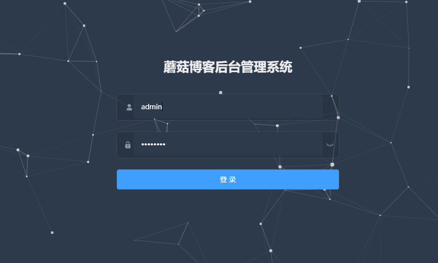

# Vue中input框自动聚焦

## 前言

今天在蘑菇博客登录的时候，就发现一个问题，因为在input绑定了键盘事件，按回车的时候就出发登录事件，但是因为Chrome会自动保存密码，所以也就说第一次登录的时候才会输入账号和密码



而在以后的登录，因为浏览器自动会填充账号和密码，因此就点击输入框进行输入了，那么input框上绑定的回车事件也没有用，只有手动点击登录按钮才能够登录

## 解决方案

其实解决的方案也比较简单，就是需要我们在进入登录页面的时候，input框自动聚焦，然后我们按回车事件后，就会触发对应的方法

关于input自动聚焦的思路：

- 给需要聚焦的input设置ref

```
        <el-input
          v-model="loginForm.username"
          ref="userNameInput"
          name="username"
          type="text"
          auto-complete="on"
          placeholder="username"
          @keyup.enter.native="handleLogin"
        />
```

- 创建一个聚焦的方法

this.$nextTick()将回调延迟到下次 DOM 更新循环之后执行。在修改数据之后立即使用它，然后等待 DOM 更新

```
    inputFocus: function() {
      this.$nextTick(x => {
        this.$refs.userNameInput.focus()
      })
    },
```

- 在create方法中调用

```
  created() {
    this.inputFocus()
  },
```

这样每次加载登录页面的时候，就会自动对input框进行聚焦了，然后只需要按下回车，即可登录到后台系统~

因为我们都知道，vue的钩子函数created，在调用的时候，Dom还没有进行任何渲染，如果我们直接执行 

```
this.$refs.userNameInput.focus()
```

这个代码的话，是没有效果的，因此需要使用this.$nextTick()，将它延迟到下次Dom渲染的时候执行

但是如果我们在mounted钩子函数执行的话，因为当mounted钩子函数执行的时候，Dom树已经渲染完毕了，那么就可以直接获取对应的dom进行渲染，也就不需要使用this.$nextTick()方法了，因此我们还可以直接这样写

```
  mounted() {
    this.$refs.userNameInput.focus()
  },
```


