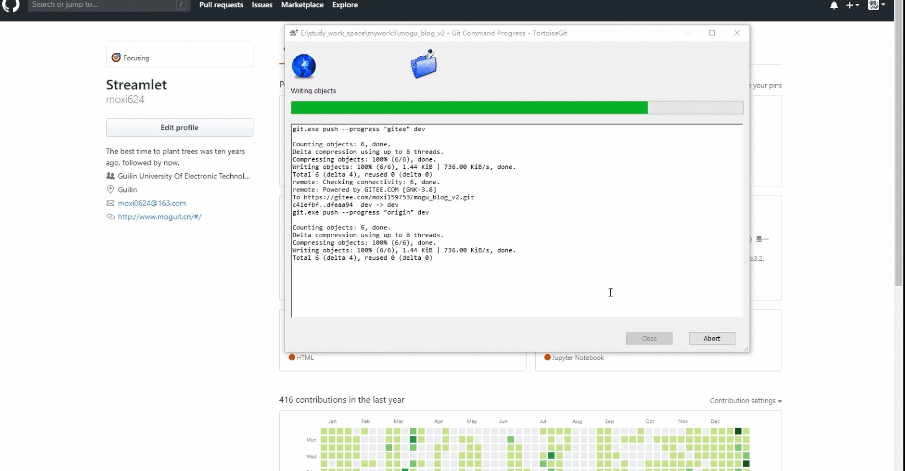
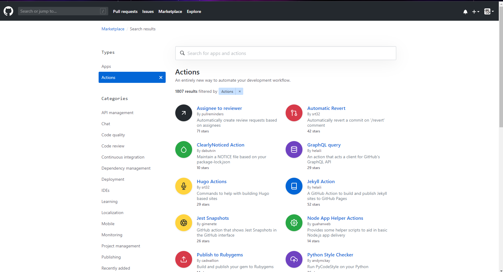
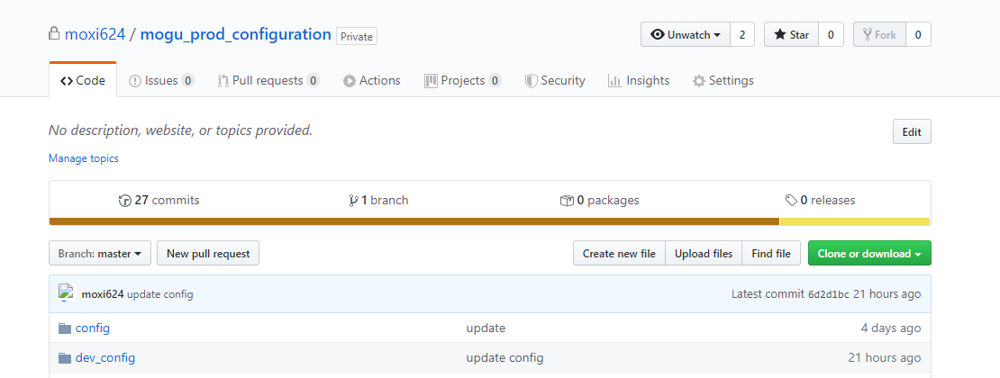
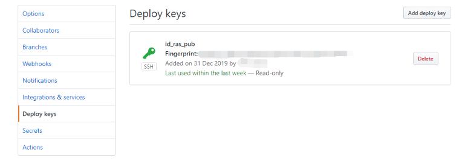
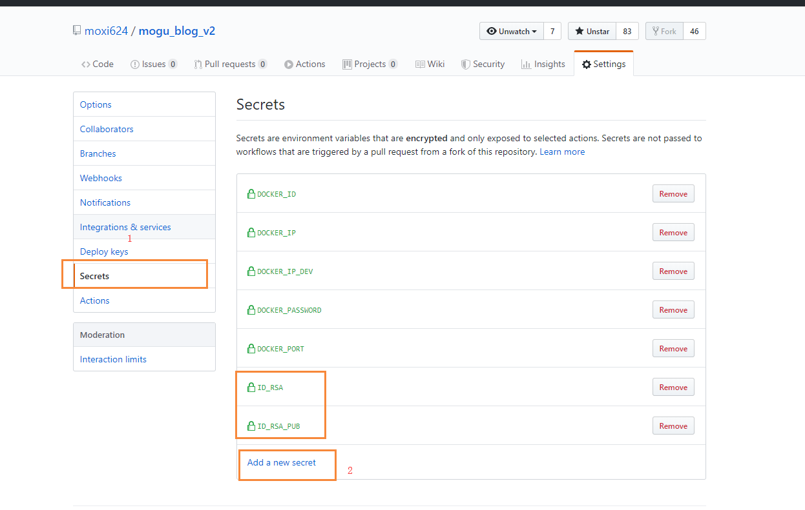
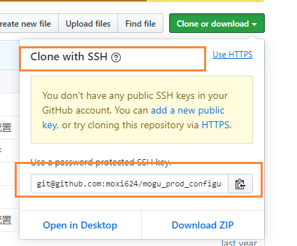

# 使用Github Action完成蘑菇博客持续集成

## 前言

这阵子一直在研究自动化部署这块，之前人肉运维的方式，虽说能够完成要求，但是每次都要编译、打包、上传到服务器，然后启动项目，这些步骤做多了就感觉非常的花费时间，因为每次进行这样一系列的操作，可能就需要大概一个小时左右，长年累月，大量的时间花费在这上面了，所以目前迫切的需要一个能够持续集成的功能。目前主要的继续集成方案有：

- Jenkins + Gitlab + Docker
- Github Actions

因为考虑到Jenkins + Gitlab 需要我们在自己的服务器安装Jenkins 和 Gitlab私有库，这样就会比较消耗我们自己服务器的空间，而最近Github提供的Actions服务，慷慨的给Actions提供了计算资源，也就是说我们可以在Github提供的一个独立容器中，给我们的项目进行构建，最后在通过Scp和SSH等命令，分发到我们的服务器上，最后启动项目。

下面我就开门见山，展示一下最终结果



当我们提交代码时，会自动执行对应的actions，然后开始进行脚本构建，自动完成项目的编译、打包、部署。

## 什么是Github Actions？

我们都知道持续集成由很多步骤组成

- 抓取代码
- 编译，运行测试，打包
- 登录远程服务器
- 发布到第三方服务
- .....

Github统一将上述操作称为Actions，其中里面的很多操作在项目中是相同的，完全可以共享，因此Github就想到了把每个操作写成一个独立的脚本文件，存放到代码仓库中，让其它用户可以直接引入某个action，从而不必自己写复杂的脚本。

我们通过一系列的Action组合，在加上自己部分业务逻辑的脚本，就组合成了一个Actions，我们称这个Actions为持续集成，这就是Github Actions的特别之处，同时Github有专门一个Action仓库，我们通过在里面挑选合适的脚本进行组合，即可完成自己的持续集成方案了




Github Actions传送门：[点我传送](https://github.com/marketplace?type=actions)

## Github Actions原理

Github Actions 官方文档：[点我传送](https://help.github.com/en/actions/automating-your-workflow-with-github-actions)

Github Actions 优势：

- 通过 Docker 隔离，每个Actions的运行都在独立的Docker容器
- GitHub 提供慷慨的计算资源（每个 workflow 会独享 1 核虚拟 CPU, 3.75GB 内存, 网络权限和 100GB 的磁盘空间, 感觉比我的 VPS 性能还好）
- 代码上下文（可以获取触发 Actions 的代码上下文环境, 比如当前分支）
- 提供一种新的配置语言和一个体验非常现代化的 workflow 编辑器

Github Actions 限制：

- 支持在代码仓库的 Settings 中增加不超过 100 个密钥(比如 Slack, S3 等), 供 workflow 使用; 也可以直接使用可视化编辑器增加
- Workflow 的 Action 支持设置 Icon 和 Icon 背景色
- workflow 有一定限制

GitHub Actions 拥有非常大的灵活度和足够的计算资源, 足够做很多很多以前需要靠 CI 或者通过配置 jenkins 来实现的功能. GitHub Actions 会不会抢占一些第三方类似服务的市场不好说, 但是对这份充足而且目前免费的计算资源, 会让很多开源项目和小公司技术团队的开发流程更灵活和自动化。

GitHub 在发布 Actions 的时候, 也明确说过会防止被滥用当成服务器计算机资源. 目前 GitHub workflow 本身有一些限制, 比如每个 workflow, 包括排队和执行时间, 最多 58 分钟; 每个 workflow 最多可以包含 100 个 Action; 每个仓库同一时刻只能运行两个 workflow (足够慷慨了, 这相当于你同时占据了 GitHub 近 8G 的内存资源)。

GitHub 在每个 workflow 触发的时候, 给 workflow 创建一台虚拟机, 作为 workflow 的执行环境(Runtime), 然后之后一系列的 Actions 是在这个 Runtime 环境里面执行 docker 命令, pull 对应的 docker 镜像, 执行脚本. 而这一切都需要在 58 分钟之内完成。

## 基本概念

Github Actions有自己的专业名词

- **workflow（工作流程）**：我们的一个持续集成运行过程，就是一个workflow
- **job（任务）**：一个workflow由一个或多个jobs构成，也就是说我们一个工作流程可以完成多个任务
- **step（步骤）**：每个Job又是由多个step组成，我们通过不同的步骤进行叠加，最终完成一个job
- **action（动作）**：每个step相当于一系列的动作组成

## Workflow文件

GitHub Actions 的配置文件叫做 workflow 文件，存放在代码仓库的`.github/workflows`目录

workflow文件采用的是YAML格式，文件名可以任意取，但是后缀统一为yml，例如我创建了两个

```
actions_dev.yml
actions_master.yml
```

这里两个配置文件分别是对应着博客的dev版发布 和 master版发布

一个库可以有多个 workflow 文件。GitHub 只要发现`.github/workflows`目录里面有`.yml`文件，就会自动运行该文件，关于workflow的配置有很多，可以参考文档：[点我传送](https://help.github.com/en/actions/automating-your-workflow-with-github-actions/workflow-syntax-for-github-actions)

下面主要是列举一下常用的配置：

### name

用于定义一个workflow的名词，如果省略该字段，默认为workflow的文件名

```
name: mogu CI/CD
```

### on

指的是触发workflow的条件，通常是指某些事件，比如 pull，push，pull request，start，fork等，都可以触发我们的workflow，例如下面代码是项目 master分支有push提交时触发

```
on: 
  push:
    branches: 
      - master
```

`on`字段也可以是事件的数组

```
on: [push, pull_request]
```

上面代码指定，`push`事件或`pull_request`事件都可以触发 workflow，同时Github也可以支持外部事件出发，或者定时运行等操作。

### jobs.name

workflow文件的主体是由一个个job构成，表示要执行的一个或多个任务

iobs字段中，需要写出每一项任务的job_id，具体名称子弟应

```
jobs:
  my_first_job:
    name: My first job
  my_second_job:
    name: My second job
```

### jobs.runs-on

runs-on字段表示运行所需的虚拟机环境，它是一个必填字段，目前有如下可以提供

- ubuntu-latest，ubuntu-18.04或ubuntu-16.04
- windows-latest，windows-2019或windows-2016
- macOS-latest或macOS-10.14

```
jobs:
  build:
    runs-on: ubuntu-latest
```

蘑菇博客的job指定的是ubuntu环境

### jobs.steps

steps字段指定了每个job的运行步骤，可以包含多个每周，并且每个步骤都可以指定以下字段

- steps.name：步骤名称
- steps.run：步骤运行的命令或者action
- steps.env：步骤所需的环境变量


## 开始一个Actioins

我们进入我们的Github项目，然后点击Actions


这时候会自动创建一个maven.yml

```
name: Java CI     #Actions名称

on: [push]        # Action触发条件，当有push提交的时候，触发

jobs:
  build:
	runs-on: ubuntu-latest    #运行环境

steps:
- uses: actions/checkout@v1    # 使用别人的action，checkout指的是拉取本仓库代码
- name: Set up JDK 1.8
  uses: actions/setup-java@v1  #使用官方脚本创建java环境
  with:
    java-version: 1.8
- name: Build with Maven
  run: mvn -B package --file pom.xml
```

下面我们需要写自己的，但蘑菇博客的master分支有提交的时候

```
name: Java CI     #Actions名称

on: 
  push:
    branches: 
      - master       #在提交master时触发
jobs:
  build:
	runs-on: ubuntu-latest    #运行环境
steps:

- uses: actions/checkout@master    #获取master分支
  with:
    ref: master  # 切换到master分支
- name: Set up JDK 1.8
  uses: actions/setup-java@v1  #使用官方脚本创建java环境
  with:
    java-version: 1.8
```

## 配置私有的博客配置文件仓库

因为我们需要在编译的时候获取到线上环境的配置环境，而线上环境的配置环境有很多服务器密码等信息，不利于开源公开，所以需要创建一个私有库来存放这些信息。

下面我创建了一个私有仓库：mogu_prod_configuration，里面主要存放了线上环境，以及测试环境的配置文件



里面目录结构如下所示：


每个项目里面存放了对应的配置文件，如mogu_admin、mogu_eureka、mogu_picture、mogu_sms、mogu_web存在的是各自的application.yml文件


而vue_mogu_admin 和 vue_mogu_web 则存在的是对应的prod.env.js文件

其中需要注意的是，因为admin还需要修改ckeditor的配置，所以里面也存在的ckeditor 的config.js文件


在我们都把对应的配置创建完成后，提交到自己的私有仓库，因为是私有仓库，需要配置免密登录，在服务器中，执行下列命令

```
ssh-keygen -t rsa
```

这时候会生成id_rsa  id_rsa.pub两个文件，我们将id_rsa.pub文件中的内容放入该私有库

Settings->Deploy keys



将id_rsa中的内容写入蘑菇博客项目的Secrets中（非配置文件私有库），这样我们就可以在Actions中引入该私钥而不会暴露出来。在Actions中写入该步骤，实现Actions中的服务器可以访问私有库


然后进行添加：



注意每次添加完后，要是想修改的话，只能够重新删除，在添加。这里主要添加的几个Secrets有：

```
DOCKER_ID：云服务器登录名，如root等
DOCKER_IP：云服务器IP地址
DOCKER_PASSWORD：云服务器IP地址
DOCKER_PORT：云服务器ssh端口
ID_RSA：私钥
ID_RSA_PUB：公钥
```

通过${{ secrets.xxxxx }}引用，实例如下

```
  - name: Set SSH Environment
    run: |
      mkdir -p ~/.ssh/
      echo "${{ secrets.ID_RSA }}" > ~/.ssh/id_rsa
      echo "${{ secrets.ID_RSA_PUB }}" > ~/.ssh/id_rsa.pub
      cat ~/.ssh/id_rsa.pub >> ~/.ssh/authorized_keys
      chmod 600 ~/.ssh/id_rsa
      chmod 700 ~/.ssh && chmod 700 ~/.ssh/*
      ls -l ~/.ssh/
```

补充

*密钥验证*

- 机器1生成密钥对并将公钥发给机器2，机器2将公钥保存。
- 机器1要登录机器2时，机器2生成随机字符串并用机器1的公钥加密后，发给机器1。
- 机器1用私钥将其解密后发回给机器2，验证成功后登录

## 获取蘑菇博客配置文件

下面我们就需要使用git clone命令下载我们的配置文件了，在下载之前，我们首先需要配置好ssh免密登录



```
git clone git@github.com:moxi624/mogu_prod_configuration.git
```

完整的action如下：run表示运行的是脚本文件，我们要做的是把刚刚下载的配置文件，使用mv命令，替换我们项目中的各个目录下的配置文件...

```
    - name: Download config file and replace
      run: |
        git clone git@github.com:moxi624/mogu_prod_configuration.git
        mv -f ./mogu_prod_configuration/dev_config/mogu_admin/application.yml ./mogu_admin/src/main/resources/application.yml
        mv -f ./mogu_prod_configuration/dev_config/mogu_eureka/application.yml ./mogu_eureka/src/main/resources/application.yml
        mv -f ./mogu_prod_configuration/dev_config/mogu_picture/application.yml ./mogu_picture/src/main/resources/application.yml
        mv -f ./mogu_prod_configuration/dev_config/mogu_sms/application.yml ./mogu_sms/src/main/resources/application.yml
        mv -f ./mogu_prod_configuration/dev_config/mogu_web/application.yml ./mogu_web/src/main/resources/application.yml
        mv -f ./mogu_prod_configuration/dev_config/vue_mogu_admin/config.js ./vue_mogu_admin/static/ckeditor/config.js
        mv -f ./mogu_prod_configuration/dev_config/vue_mogu_admin/prod.env.js ./vue_mogu_admin/config/prod.env.js
        mv -f ./mogu_prod_configuration/dev_config/vue_mogu_web/prod.env.js ./vue_mogu_web/config/prod.env.js
```

然后执行 mvn clean install进行打包

```
- name: Build Java jar
      run: | 
        mvn clean install
```

下面的操作是对vue_mogu_admin 和 vue_mogu_web进行打包，首先是安装node，然后执行

```
# 安装依赖
npm install
# 打包
npm run build
```

完整代码如下：

```
    - name: Use Node.js 12.x
      uses: actions/setup-node@v1
      with:
        node-version: 12.x    
    - name: Build vue_mogu_admin and vue_mogu_web
      run: |
        cd ./vue_mogu_admin
        npm install
        npm run build
        cd ..
        cd ./vue_mogu_web
        npm install
        npm run build
        cd ..
```

## 将构建好的文件打包

在我们将maven项目和vue项目进行打包后，我们要做的是将他们进行压缩，传递到我们的服务器

首先是创建一个文件夹，将刚刚生成的jar包和静态页面dist，全部放到文件夹下，然后使用tar命令进行压缩

```
    - name: Move files and compress
      run: |
        mkdir -p transfer_files
        mv ./mogu_admin/target/mogu_admin-0.0.1-SNAPSHOT.jar ./transfer_files/mogu_admin-0.0.1-SNAPSHOT.jar
        mv ./mogu_sms/target/mogu_sms-0.0.1-SNAPSHOT.jar ./transfer_files/mogu_sms-0.0.1-SNAPSHOT.jar
        mv ./mogu_eureka/target/mogu_eureka-0.0.1-SNAPSHOT.jar ./transfer_files/mogu_eureka-0.0.1-SNAPSHOT.jar
        mv ./mogu_picture/target/mogu_picture-0.0.1-SNAPSHOT.jar ./transfer_files/mogu_picture-0.0.1-SNAPSHOT.jar
        mv ./mogu_web/target/mogu_web-0.0.1-SNAPSHOT.jar ./transfer_files/mogu_web-0.0.1-SNAPSHOT.jar
        mv ./vue_mogu_web/dist ./transfer_files/web_dist
        mv ./vue_mogu_admin/dist ./transfer_files/admin_dist
        tar -zcvf  transfer_files.tar.gz transfer_files/
```

## 使用Scp脚本拷贝到服务器

在这一步，我们就需要将我们刚刚压缩好的 transfer_files.tar.gz 超拷贝我们的阿里云服务器上，在这里我们无法直接使用scp命令，而需要借助别人写的的一个脚本：appleboy/scp-action@master

这里面需要用到刚刚我们定义的Secrets，如果没有的话，是无法完成的，source是我们需要拷贝的文件，target是我们需要拷贝的目标服务器的地址，完整代码如下所示：

```
    - name: Scp file to aliyun
      uses: appleboy/scp-action@master
      with:
        host: ${{ secrets.DOCKER_IP_DEV }}
        username: ${{ secrets.DOCKER_ID }}
        password: ${{ secrets.DOCKER_PASSWORD }}
        port: ${{ secrets.DOCKER_PORT }}
        source: "transfer_files.tar.gz"
        target: "/home"
```

## 文件分发和备份

在这步的action中，我们要做的事情是，使用ssh远程登录我们的云服务器，然后将我们的刚刚拷贝过来的压缩包解压，然后分发到各自的目录下，同时还需要将原来的文件进行备份和删除

这里远程连接ssh，也是引用的别人的action：appleboy/ssh-action@master

```
    - name: Distribution and backup
      uses: appleboy/ssh-action@master
      with:
        host: ${{ secrets.DOCKER_IP_DEV }}
        username: ${{ secrets.DOCKER_ID }}
        password: ${{ secrets.DOCKER_PASSWORD }}
        port: ${{ secrets.DOCKER_PORT }}
```

登录进去后，我们需要做的是，首先进入到home目录下，然后解压

```
script: |
          cd /home
          tar -zxvf /home/transfer_files.tar.gz

```

然后判断原来的备份文件是否存在，如果存在那么需要删除

```
if [ -f "/home/mogu_blog/mogu_admin/mogu_admin-0.0.1-SNAPSHOT.jar.bak" ];then
	echo "mogu_admin.jar.bak exists and is being deleted"
	rm -f /home/mogu_blog/mogu_admin/mogu_admin-0.0.1-SNAPSHOT.jar.bak
fi
```

然后把现在的jar文件进行备份

```
if [ -f "/home/mogu_blog/mogu_admin/mogu_admin-0.0.1-SNAPSHOT.jar" ];then
	echo "mogu_admin.jar exists and is being backup"
	mv /home/mogu_blog/mogu_admin/mogu_admin-0.0.1-SNAPSHOT.jar 		/home/mogu_blog/mogu_admin/mogu_admin-0.0.1-SNAPSHOT.jar.bak
fi
```

然后在从解压的文件夹中把对应的jar移动过来

```
mv /home/transfer_files/mogu_admin-0.0.1-SNAPSHOT.jar /home/mogu_blog/mogu_admin/mogu_admin-0.0.1-SNAPSHOT.jar
```

完整的动作如下所示，我们需要将 mogu_eureka、mogu_picture、mogu_sms、mogu_admin、mogu_web、以及vue_mogu_web 和 vue_mogu_admin 都替换一遍。

```
    - name: Distribution and backup
      uses: appleboy/ssh-action@master
      with:
        host: ${{ secrets.DOCKER_IP_DEV }}
        username: ${{ secrets.DOCKER_ID }}
        password: ${{ secrets.DOCKER_PASSWORD }}
        port: ${{ secrets.DOCKER_PORT }}
        script: |
          cd /home
          tar -zxvf /home/transfer_files.tar.gz

          echo "################# mogu_admin moving #################"

          if [ -f "/home/mogu_blog/mogu_admin/mogu_admin-0.0.1-SNAPSHOT.jar.bak" ];then
            echo "mogu_admin.jar.bak exists and is being deleted"
            rm -f /home/mogu_blog/mogu_admin/mogu_admin-0.0.1-SNAPSHOT.jar.bak
          fi
          if [ -f "/home/mogu_blog/mogu_admin/mogu_admin-0.0.1-SNAPSHOT.jar" ];then
            echo "mogu_admin.jar exists and is being backup"
            mv /home/mogu_blog/mogu_admin/mogu_admin-0.0.1-SNAPSHOT.jar /home/mogu_blog/mogu_admin/mogu_admin-0.0.1-SNAPSHOT.jar.bak
          fi
          mv /home/transfer_files/mogu_admin-0.0.1-SNAPSHOT.jar /home/mogu_blog/mogu_admin/mogu_admin-0.0.1-SNAPSHOT.jar


          echo "################# mogu_sms moving #################"

          if [ -f "/home/mogu_blog/mogu_sms/mogu_sms-0.0.1-SNAPSHOT.jar.bak" ];then
            echo "mogu_sms.jar.bak exists and is being deleted"
            rm -f /home/mogu_blog/mogu_sms/mogu_sms-0.0.1-SNAPSHOT.jar.bak
          fi
          if [ -f "/home/mogu_blog/mogu_admin/mogu_admin-0.0.1-SNAPSHOT.jar" ];then
            echo "mogu_sms.jar exists and is being backup"
            mv /home/mogu_blog/mogu_sms/mogu_sms-0.0.1-SNAPSHOT.jar /home/mogu_blog/mogu_sms/mogu_sms-0.0.1-SNAPSHOT.jar.bak
          fi
          mv /home/transfer_files/mogu_sms-0.0.1-SNAPSHOT.jar /home/mogu_blog/mogu_sms/mogu_sms-0.0.1-SNAPSHOT.jar


          echo "################# mogu_eureka moving #################"

          if [ -f "/home/mogu_blog/mogu_eureka/mogu_eureka-0.0.1-SNAPSHOT.jar.bak" ];then
            echo "mogu_eureka.jar.bak exists and is being deleted"
            rm -f /home/mogu_blog/mogu_eureka/mogu_eureka-0.0.1-SNAPSHOT.jar.bak
          fi
          if [ -f "/home/mogu_blog/mogu_eureka/mogu_eureka-0.0.1-SNAPSHOT.jar" ];then
            echo "mogu_eureka.jar exists and is being backup"
            mv /home/mogu_blog/mogu_eureka/mogu_eureka-0.0.1-SNAPSHOT.jar /home/mogu_blog/mogu_eureka/mogu_eureka-0.0.1-SNAPSHOT.jar.bak
          fi
          mv /home/transfer_files/mogu_eureka-0.0.1-SNAPSHOT.jar /home/mogu_blog/mogu_eureka/mogu_eureka-0.0.1-SNAPSHOT.jar


          echo "################# mogu_picture moving #################"

          if [ -f "/home/mogu_blog/mogu_picture/mogu_picture-0.0.1-SNAPSHOT.jar.bak" ];then
            echo "mogu_picture.jar.bak exists and is being deleted"
            rm -f /home/mogu_blog/mogu_picture/mogu_picture-0.0.1-SNAPSHOT.jar.bak
          fi
          if [ -f "/home/mogu_blog/mogu_picture/mogu_picture-0.0.1-SNAPSHOT.jar" ];then
            echo "mogu_picture.jar exists and is being backup"
            mv /home/mogu_blog/mogu_picture/mogu_picture-0.0.1-SNAPSHOT.jar /home/mogu_blog/mogu_picture/mogu_picture-0.0.1-SNAPSHOT.jar.bak
          fi
          mv /home/transfer_files/mogu_picture-0.0.1-SNAPSHOT.jar /home/mogu_blog/mogu_picture/mogu_picture-0.0.1-SNAPSHOT.jar


          echo "################# mogu_web moving #################"

          if [ -f "/home/mogu_blog/mogu_web/mogu_web-0.0.1-SNAPSHOT.jar.bak" ];then
            echo "mogu_web.jar.bak exists and is being deleted"
            rm -f /home/mogu_blog/mogu_web/mogu_web-0.0.1-SNAPSHOT.jar.bak
          fi
          if [ -f "/home/mogu_blog/mogu_web/mogu_web-0.0.1-SNAPSHOT.jar" ];then
            echo "mogu_web.jar exists and is being backup"
            mv /home/mogu_blog/mogu_web/mogu_web-0.0.1-SNAPSHOT.jar /home/mogu_blog/mogu_web/mogu_web-0.0.1-SNAPSHOT.jar.bak
          fi
          mv /home/transfer_files/mogu_web-0.0.1-SNAPSHOT.jar /home/mogu_blog/mogu_web/mogu_web-0.0.1-SNAPSHOT.jar


          echo "################# vue_mogu_web moving #################"

          if [ -d "/home/mogu_blog/vue_mogu_web/dist.bak/" ];then
            echo "vue_mogu_web dist.bak exists and is being deleted"
            cd /home/mogu_blog/vue_mogu_web
            rm -rf dist.bak/
          fi
          if [ -d "/home/mogu_blog/vue_mogu_web/dist/" ];then
            echo "vue_mogu_web dist exists and is being backup"
            mv /home/mogu_blog/vue_mogu_web/dist /home/mogu_blog/vue_mogu_web/dist.bak
          fi
          mv /home/transfer_files/web_dist /home/mogu_blog/vue_mogu_web/dist

          echo "################# vue_mogu_admin moving #################"

          if [ -d "/home/mogu_blog/vue_mogu_admin/dist.bak/" ];then
            echo "vue_mogu_admin dist.bak exists and is being deleted"
            cd /home/mogu_blog/vue_mogu_admin
            rm -rf dist.bak/
          fi
          if [ -d "/home/mogu_blog/vue_mogu_admin/dist/" ];then
            echo "vue_mogu_admin dist exists and is being backup"
            mv /home/mogu_blog/vue_mogu_admin/dist /home/mogu_blog/vue_mogu_admin/dist.bak
          fi
          mv /home/transfer_files/admin_dist /home/mogu_blog/vue_mogu_admin/dist

          echo "################# rm transfer_files.tar.gz #################"
          rm -rf /home/transfer_files.tar.gz
          echo "################# rm transfer_files #################"
          rm -rf /home/transfer_files
```

## 启动项目

在我们替换完成后，我们要做的就是启动我们的项目了，同样也是使用ssh连接我们的云服务器，然后进入各自的目录下，执行启动脚本

```
 - name: Start mogu_eureka
      uses: appleboy/ssh-action@master
      with:
        host: ${{ secrets.DOCKER_IP_DEV }}
        username: ${{ secrets.DOCKER_ID }}
        password: ${{ secrets.DOCKER_PASSWORD }}
        port: ${{ secrets.DOCKER_PORT }}
        script: |
          cd /home/mogu_blog/mogu_eureka/
          ./shutdown.sh
          ./startup.sh
```

## 完整的workflow文件

如果小伙伴有多个服务器的话，可以配置两个workflow文件，一个用来监听测试分支的改动，一个用来测试master主分支的改动，这样首先将代码提交到测试服务器后，然后测试没问题，在提交到正式服务器~，下面是完整的workflow文件：

```
name: mogu CI/CD/DEV

on: 
  push:
    branches: 
      - dev

jobs:
  build:

    runs-on: ubuntu-latest

    steps:
    - uses: actions/checkout@master
      with:
        ref: dev 
    - uses: actions/setup-java@v1
      with:
        java-version: 1.8
    - name: Set SSH Environment
      run: |
        mkdir -p ~/.ssh/
        echo "${{ secrets.ID_RSA }}" > ~/.ssh/id_rsa
        echo "${{ secrets.ID_RSA_PUB }}" > ~/.ssh/id_rsa.pub
        cat ~/.ssh/id_rsa.pub >> ~/.ssh/authorized_keys
        chmod 600 ~/.ssh/id_rsa
        chmod 700 ~/.ssh && chmod 700 ~/.ssh/*
        ls -l ~/.ssh/
    - name: Download config file and replace
      run: |
        git clone git@github.com:moxi624/mogu_prod_configuration.git
        mv -f ./mogu_prod_configuration/dev_config/mogu_admin/application.yml ./mogu_admin/src/main/resources/application.yml
        mv -f ./mogu_prod_configuration/dev_config/mogu_eureka/application.yml ./mogu_eureka/src/main/resources/application.yml
        mv -f ./mogu_prod_configuration/dev_config/mogu_picture/application.yml ./mogu_picture/src/main/resources/application.yml
        mv -f ./mogu_prod_configuration/dev_config/mogu_sms/application.yml ./mogu_sms/src/main/resources/application.yml
        mv -f ./mogu_prod_configuration/dev_config/mogu_web/application.yml ./mogu_web/src/main/resources/application.yml
        mv -f ./mogu_prod_configuration/dev_config/vue_mogu_admin/config.js ./vue_mogu_admin/static/ckeditor/config.js
        mv -f ./mogu_prod_configuration/dev_config/vue_mogu_admin/prod.env.js ./vue_mogu_admin/config/prod.env.js
        mv -f ./mogu_prod_configuration/dev_config/vue_mogu_web/prod.env.js ./vue_mogu_web/config/prod.env.js
    - name: Build Java jar
      run: | 
        mvn clean install
    - name: Use Node.js 12.x
      uses: actions/setup-node@v1
      with:
        node-version: 12.x    
    - name: Build vue_mogu_admin and vue_mogu_web
      run: |
        cd ./vue_mogu_admin
        npm install
        npm run build
        cd ..
        cd ./vue_mogu_web
        npm install
        npm run build
        cd ..
    - name: Move files and compress
      run: |
        mkdir -p transfer_files
        mv ./mogu_admin/target/mogu_admin-0.0.1-SNAPSHOT.jar ./transfer_files/mogu_admin-0.0.1-SNAPSHOT.jar
        mv ./mogu_sms/target/mogu_sms-0.0.1-SNAPSHOT.jar ./transfer_files/mogu_sms-0.0.1-SNAPSHOT.jar
        mv ./mogu_eureka/target/mogu_eureka-0.0.1-SNAPSHOT.jar ./transfer_files/mogu_eureka-0.0.1-SNAPSHOT.jar
        mv ./mogu_picture/target/mogu_picture-0.0.1-SNAPSHOT.jar ./transfer_files/mogu_picture-0.0.1-SNAPSHOT.jar
        mv ./mogu_web/target/mogu_web-0.0.1-SNAPSHOT.jar ./transfer_files/mogu_web-0.0.1-SNAPSHOT.jar
        mv ./vue_mogu_web/dist ./transfer_files/web_dist
        mv ./vue_mogu_admin/dist ./transfer_files/admin_dist
        tar -zcvf  transfer_files.tar.gz transfer_files/
    - name: Scp file to aliyun
      uses: appleboy/scp-action@master
      with:
        host: ${{ secrets.DOCKER_IP_DEV }}
        username: ${{ secrets.DOCKER_ID }}
        password: ${{ secrets.DOCKER_PASSWORD }}
        port: ${{ secrets.DOCKER_PORT }}
        source: "transfer_files.tar.gz"
        target: "/home"
    - name: Distribution and backup
      uses: appleboy/ssh-action@master
      with:
        host: ${{ secrets.DOCKER_IP_DEV }}
        username: ${{ secrets.DOCKER_ID }}
        password: ${{ secrets.DOCKER_PASSWORD }}
        port: ${{ secrets.DOCKER_PORT }}
        script: |
          cd /home
          tar -zxvf /home/transfer_files.tar.gz

          echo "################# mogu_admin moving #################"

          if [ -f "/home/mogu_blog/mogu_admin/mogu_admin-0.0.1-SNAPSHOT.jar.bak" ];then
            echo "mogu_admin.jar.bak exists and is being deleted"
            rm -f /home/mogu_blog/mogu_admin/mogu_admin-0.0.1-SNAPSHOT.jar.bak
          fi
          if [ -f "/home/mogu_blog/mogu_admin/mogu_admin-0.0.1-SNAPSHOT.jar" ];then
            echo "mogu_admin.jar exists and is being backup"
            mv /home/mogu_blog/mogu_admin/mogu_admin-0.0.1-SNAPSHOT.jar /home/mogu_blog/mogu_admin/mogu_admin-0.0.1-SNAPSHOT.jar.bak
          fi
          mv /home/transfer_files/mogu_admin-0.0.1-SNAPSHOT.jar /home/mogu_blog/mogu_admin/mogu_admin-0.0.1-SNAPSHOT.jar


          echo "################# mogu_sms moving #################"

          if [ -f "/home/mogu_blog/mogu_sms/mogu_sms-0.0.1-SNAPSHOT.jar.bak" ];then
            echo "mogu_sms.jar.bak exists and is being deleted"
            rm -f /home/mogu_blog/mogu_sms/mogu_sms-0.0.1-SNAPSHOT.jar.bak
          fi
          if [ -f "/home/mogu_blog/mogu_admin/mogu_admin-0.0.1-SNAPSHOT.jar" ];then
            echo "mogu_sms.jar exists and is being backup"
            mv /home/mogu_blog/mogu_sms/mogu_sms-0.0.1-SNAPSHOT.jar /home/mogu_blog/mogu_sms/mogu_sms-0.0.1-SNAPSHOT.jar.bak
          fi
          mv /home/transfer_files/mogu_sms-0.0.1-SNAPSHOT.jar /home/mogu_blog/mogu_sms/mogu_sms-0.0.1-SNAPSHOT.jar


          echo "################# mogu_eureka moving #################"

          if [ -f "/home/mogu_blog/mogu_eureka/mogu_eureka-0.0.1-SNAPSHOT.jar.bak" ];then
            echo "mogu_eureka.jar.bak exists and is being deleted"
            rm -f /home/mogu_blog/mogu_eureka/mogu_eureka-0.0.1-SNAPSHOT.jar.bak
          fi
          if [ -f "/home/mogu_blog/mogu_eureka/mogu_eureka-0.0.1-SNAPSHOT.jar" ];then
            echo "mogu_eureka.jar exists and is being backup"
            mv /home/mogu_blog/mogu_eureka/mogu_eureka-0.0.1-SNAPSHOT.jar /home/mogu_blog/mogu_eureka/mogu_eureka-0.0.1-SNAPSHOT.jar.bak
          fi
          mv /home/transfer_files/mogu_eureka-0.0.1-SNAPSHOT.jar /home/mogu_blog/mogu_eureka/mogu_eureka-0.0.1-SNAPSHOT.jar


          echo "################# mogu_picture moving #################"

          if [ -f "/home/mogu_blog/mogu_picture/mogu_picture-0.0.1-SNAPSHOT.jar.bak" ];then
            echo "mogu_picture.jar.bak exists and is being deleted"
            rm -f /home/mogu_blog/mogu_picture/mogu_picture-0.0.1-SNAPSHOT.jar.bak
          fi
          if [ -f "/home/mogu_blog/mogu_picture/mogu_picture-0.0.1-SNAPSHOT.jar" ];then
            echo "mogu_picture.jar exists and is being backup"
            mv /home/mogu_blog/mogu_picture/mogu_picture-0.0.1-SNAPSHOT.jar /home/mogu_blog/mogu_picture/mogu_picture-0.0.1-SNAPSHOT.jar.bak
          fi
          mv /home/transfer_files/mogu_picture-0.0.1-SNAPSHOT.jar /home/mogu_blog/mogu_picture/mogu_picture-0.0.1-SNAPSHOT.jar


          echo "################# mogu_web moving #################"

          if [ -f "/home/mogu_blog/mogu_web/mogu_web-0.0.1-SNAPSHOT.jar.bak" ];then
            echo "mogu_web.jar.bak exists and is being deleted"
            rm -f /home/mogu_blog/mogu_web/mogu_web-0.0.1-SNAPSHOT.jar.bak
          fi
          if [ -f "/home/mogu_blog/mogu_web/mogu_web-0.0.1-SNAPSHOT.jar" ];then
            echo "mogu_web.jar exists and is being backup"
            mv /home/mogu_blog/mogu_web/mogu_web-0.0.1-SNAPSHOT.jar /home/mogu_blog/mogu_web/mogu_web-0.0.1-SNAPSHOT.jar.bak
          fi
          mv /home/transfer_files/mogu_web-0.0.1-SNAPSHOT.jar /home/mogu_blog/mogu_web/mogu_web-0.0.1-SNAPSHOT.jar


          echo "################# vue_mogu_web moving #################"

          if [ -d "/home/mogu_blog/vue_mogu_web/dist.bak/" ];then
            echo "vue_mogu_web dist.bak exists and is being deleted"
            cd /home/mogu_blog/vue_mogu_web
            rm -rf dist.bak/
          fi
          if [ -d "/home/mogu_blog/vue_mogu_web/dist/" ];then
            echo "vue_mogu_web dist exists and is being backup"
            mv /home/mogu_blog/vue_mogu_web/dist /home/mogu_blog/vue_mogu_web/dist.bak
          fi
          mv /home/transfer_files/web_dist /home/mogu_blog/vue_mogu_web/dist

          echo "################# vue_mogu_admin moving #################"

          if [ -d "/home/mogu_blog/vue_mogu_admin/dist.bak/" ];then
            echo "vue_mogu_admin dist.bak exists and is being deleted"
            cd /home/mogu_blog/vue_mogu_admin
            rm -rf dist.bak/
          fi
          if [ -d "/home/mogu_blog/vue_mogu_admin/dist/" ];then
            echo "vue_mogu_admin dist exists and is being backup"
            mv /home/mogu_blog/vue_mogu_admin/dist /home/mogu_blog/vue_mogu_admin/dist.bak
          fi
          mv /home/transfer_files/admin_dist /home/mogu_blog/vue_mogu_admin/dist

          echo "################# rm transfer_files.tar.gz #################"
          rm -rf /home/transfer_files.tar.gz
          echo "################# rm transfer_files #################"
          rm -rf /home/transfer_files

    - name: Start mogu_eureka
      uses: appleboy/ssh-action@master
      with:
        host: ${{ secrets.DOCKER_IP_DEV }}
        username: ${{ secrets.DOCKER_ID }}
        password: ${{ secrets.DOCKER_PASSWORD }}
        port: ${{ secrets.DOCKER_PORT }}
        script: |
          cd /home/mogu_blog/mogu_eureka/
          ./shutdown.sh
          ./startup.sh
    - name: Start mogu_picture
      uses: appleboy/ssh-action@master
      with:
        host: ${{ secrets.DOCKER_IP_DEV }}
        username: ${{ secrets.DOCKER_ID }}
        password: ${{ secrets.DOCKER_PASSWORD }}
        port: ${{ secrets.DOCKER_PORT }}
        script: |
          cd /home/mogu_blog/mogu_picture/
          ./shutdown.sh
          ./startup.sh
    - name: Start mogu_admin
      uses: appleboy/ssh-action@master
      with:
        host: ${{ secrets.DOCKER_IP_DEV }}
        username: ${{ secrets.DOCKER_ID }}
        password: ${{ secrets.DOCKER_PASSWORD }}
        port: ${{ secrets.DOCKER_PORT }}
        script: |
          cd /home/mogu_blog/mogu_admin/
          ./shutdown.sh
          ./startup.sh
    - name: Start mogu_sms
      uses: appleboy/ssh-action@master
      with:
        host: ${{ secrets.DOCKER_IP_DEV }}
        username: ${{ secrets.DOCKER_ID }}
        password: ${{ secrets.DOCKER_PASSWORD }}
        port: ${{ secrets.DOCKER_PORT }}
        script: |
          cd /home/mogu_blog/mogu_sms/
          ./shutdown.sh
          ./startup.sh
    - name: Start mogu_web
      uses: appleboy/ssh-action@master
      with:
        host: ${{ secrets.DOCKER_IP_DEV }}
        username: ${{ secrets.DOCKER_ID }}
        password: ${{ secrets.DOCKER_PASSWORD }}
        port: ${{ secrets.DOCKER_PORT }}
        script: |
          cd /home/mogu_blog/mogu_web/
          ./shutdown.sh
          ./startup.sh
```

## 参考

- [GitHub Actions 入门教程](http://www.ruanyifeng.com/blog/2019/09/getting-started-with-github-actions.html)

- [GitHub Actions 初体验](https://zhuanlan.zhihu.com/p/52750017)

  