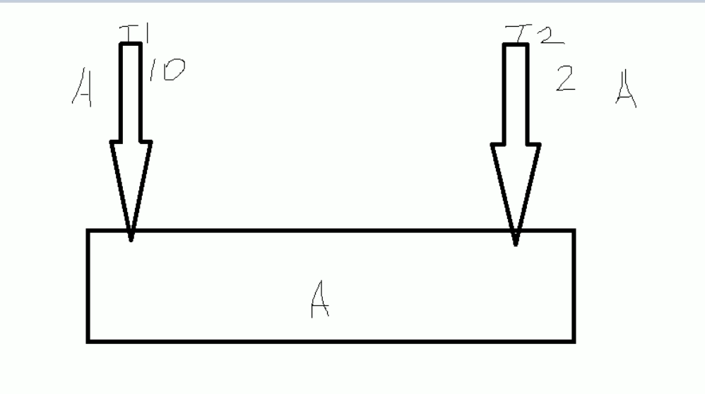

# 原子类AtomicInteger的ABA问题

## 连环套路

从AtomicInteger引出下面的问题

CAS -> Unsafe -> CAS底层思想 -> ABA -> 原子引用更新 -> 如何规避ABA问题

## ABA问题是什么

狸猫换太子



假设现在有两个线程，分别是T1 和 T2，然后T1执行某个操作的时间为10秒，T2执行某个时间的操作是2秒，最开始AB两个线程，分别从主内存中获取A值，但是因为B的执行速度更快，他先把A的值改成B，然后在修改成A，然后执行完毕，T1线程在10秒后，执行完毕，判断内存中的值为A，并且和自己预期的值一样，它就认为没有人更改了主内存中的值，就快乐的修改成B，但是实际上 可能中间经历了 ABCDEFA 这个变换，也就是中间的值经历了狸猫换太子。

所以ABA问题就是，在进行获取主内存值的时候，该内存值在我们写入主内存的时候，已经被修改了N次，但是最终又改成原来的值了

## CAS导致ABA问题

CAS算法实现了一个重要的前提，需要取出内存中某时刻的数据，并在当下时刻比较并替换，那么这个时间差会导致数据的变化。

比如说一个线程one从内存位置V中取出A，这时候另外一个线程two也从内存中取出A，并且线程two进行了一些操作将值变成了B，然后线程two又将V位置的数据变成A，这时候线程one进行CAS操作发现内存中仍然是A，然后线程one操作成功

`尽管线程one的CAS操作成功，但是不代表这个过程就是没有问题的`

## ABA问题

CAS只管开头和结尾，也就是头和尾是一样，那就修改成功，中间的这个过程，可能会被人修改过

## 原子引用

原子引用其实和原子包装类是差不多的概念，就是将一个java类，用原子引用类进行包装起来，那么这个类就具备了原子性

```
/**
 * 原子引用
 * @author: 陌溪
 * @create: 2020-03-11-22:12
 */

class User {
    String userName;
    int age;

    public User(String userName, int age) {
        this.userName = userName;
        this.age = age;
    }

    public String getUserName() {
        return userName;
    }

    public void setUserName(String userName) {
        this.userName = userName;
    }

    public int getAge() {
        return age;
    }

    public void setAge(int age) {
        this.age = age;
    }

    @Override
    public String toString() {
        return "User{" +
                "userName='" + userName + '\'' +
                ", age=" + age +
                '}';
    }
}
public class AtomicReferenceDemo {

    public static void main(String[] args) {

        User z3 = new User("z3", 22);

        User l4 = new User("l4", 25);

        // 创建原子引用包装类
        AtomicReference<User> atomicReference = new AtomicReference<>();

        // 现在主物理内存的共享变量，为z3
        atomicReference.set(z3);

        // 比较并交换，如果现在主物理内存的值为z3，那么交换成l4
        System.out.println(atomicReference.compareAndSet(z3, l4) + "\t " + atomicReference.get().toString());

        // 比较并交换，现在主物理内存的值是l4了，但是预期为z3，因此交换失败
        System.out.println(atomicReference.compareAndSet(z3, l4) + "\t " + atomicReference.get().toString());
    }
}
```

