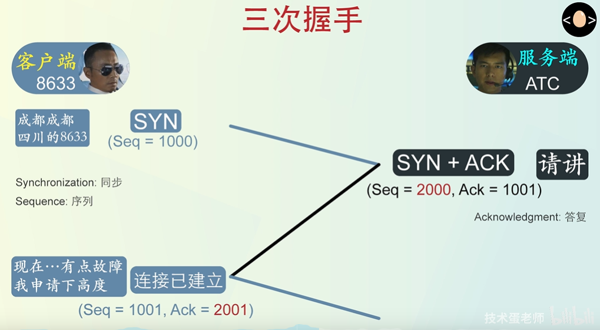

# 三次握手和四次挥手

## 三次握手

### 概念

为什么需要握手：握手的作用就是为了同步一些信息，比如最大滑动窗口

TCP：是一个可靠的连接，也就是客户端和服务器双方必须感知对方的存在，也就是需要经历一个建立连接的过程

用三次握手建立TCP连接，连接有三个阶段

- 建立连接
- 数据传输
- 连接释放

连接的管理就是使连接的建立和释放都能正常地进行，连接阶段过程中要解决以下三个问题

- 要使每一方都能确知对方的存在
- 要允许双方协商一些参数
- 能够对运输实体分配资源

### TCP连接建立过程

TCP建立连接的过程：被称为握手

① 握手过程其实是发送的TCP报文，在这里面有两个字段，SYN 和 seq

- SYN = 1：表示该报文不能携带数据，但是需要消耗一个SEQ（序号），可以想象成我们对消息编号
- seq：TCP的每个字节发送的时候，都有一个序号，主要是为了保证可靠性，比如当我服务器通过TCP报文得到了有N个字节需要接受，但是最后只接受到了N-1个，我们通过序号就知道哪个没有被接收到。

② 当服务器接受到我们的握手请求时，会回复一个确认报文

- SYN：表示不携带数据，同时消耗一个SEQ = y（这里的y是任意数字，可以是1,2,3,4）
- ACK：=1 表示这是一条确定报文
- ack：x+1，其中x是刚刚客户端发送过来的

③ 当客户端收到确认报文的时候，客户端需要对这个确认报文进行回复

- ACK：=1，表示这是一条确认报文
- seq：= x +1，
- ack：= y+1

经过了这三次握手，两者就进入了连接状态

### 通俗的理解

- 客户端：服务器，我们可以建立连接么？ ->  SYN= 1 ， seq = x
- 服务器：可以啊，我们建立连接吧 ！  -> ACK =1, SYN = 1, seq = y, ack  = x+1
- 客户端：收到，建立连接吧！  ->  ACK = 1,  SYN = 1，seq = x + 1， ack = y + 1

然后建立TCP连接

中国机长版三次握手

### 为什么是三次握手

#### 四次握手

四次连接有点多余，第三次的时候，我们已经互相进行了连接确认

但是因为我们无法保证百分百的可靠性

#### 两次握手：

客户端知道服务器有接收 和 发送的能力，服务器不知道客户端有没有接收数据的能力，因为通过第一次握手，已经知道了客户端能够发送数据，但是能不能接收数据，还是不清楚，因此这个TCP连接是不可靠的。

为什么不能两次握手就建立连接

因为超时重传机制的存在

但客户端发送第一次握手的时候，可能会经历网络拥塞，然后客户端会以为这个连接已经丢失，然后会重新发送一个请求连接的信息到服务器，这次发送的消息很快被服务器接受，然后服务器建立连接就开始建立连接。但是当第一次发送的请求经过一段时间的阻塞后，成功到达服务器，然后服务器又连接连接，而此时客户端是不会理会这次请求的建立，所以服务器一直在等待客户端数据的发送。

## 四次挥手

当客户端与服务器在规定的时间内没有得到应答

会发送报文进行探测，假设没有应答，那么就会关闭连接

下面是四次挥手的过程

