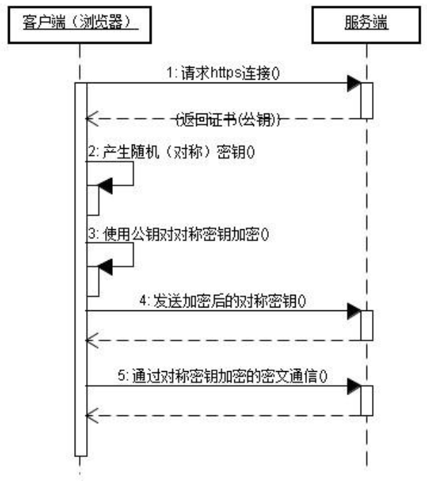
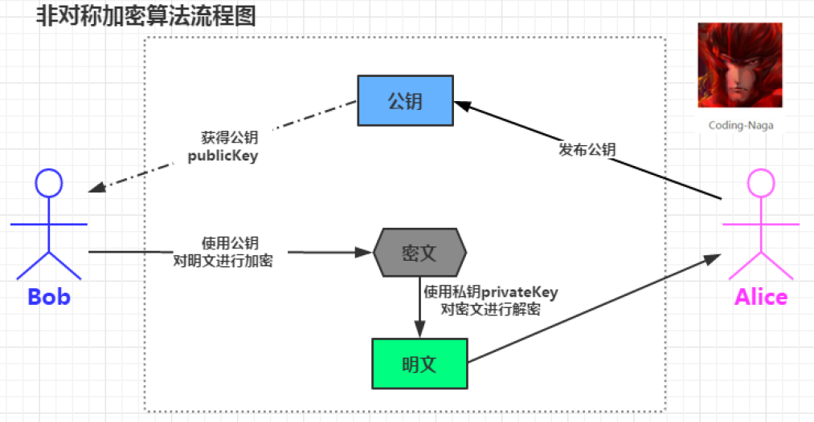

# http和https

## http

http是一种无状态协议。无状态是指客户机和服务器之间不需要建立持久连接，这意味着当一个客户端向服务器发出请求，然后服务器返回响应（response），连接就被关闭了，在服务器端不保留连接的有关信息，HTTP遵循请求/应答模型。客户机向服务器发送请求，服务器处理请求并返回适当的应答。所有HTTP连接都构成一套请求和应答。

## https

HTTPS是以安全为目标的HTTP通道，简单将就是HTTP的安全版。即HTTP下加入SSL层，HTTPS的安全基础是SSL。其所用的端口是443，过程大致如下：

### 获取连接证书

SSL客户端通过TCP和服务器建立连接后（443端口），并且在一般的TCP连接协商过程中请求证书。即客户端发出一个消息给服务器，这个消息里面包含了自己可实现的算法列表和其它一些需要的消息，SSL的服务器端会回应一个数据包，这里面确定了这次通信所需要的算法，然后服务器向客户端返回证书。（证书里面包含了服务器信息：域名。申请证书的公司，公共密钥）

### 证书验证

客户端在收到服务器返回的证书后，判断签发这个证书的公共签发机构，并使用这个机构的公共密钥确认签名是否有效，客户端还会确保证书中列出的域名就是它正在连接的域名

### 数据加密和传输

如果确认证书有效，那么生成对称密钥并使用服务器的公共密钥进行加密。然后发送给服务器，服务器使用它的密钥进行解密，这样两台计算机可以开始进行对称加密进行通信。

对称加密：是指加密和解密用的都是同一个密钥，目前微信小程序采用的就是这个加密方式

### 对称加密存在的问题

首先我们知道对称加密是指：加密和解密都使用的同一个密钥，这种方式存在的最大的问题就是密钥发送问题，即如果安全的将密钥发送给对方。

#### 为什么叫对称加密？

一方通过密钥将信息加密后，把密文传给另一个方，另一方通过这个相同的密钥将密文解密，转换成可以理解的明文。他们之间的关系如下

> 明文 -> 密钥 -> 密文

但是从上面的图我们可以看出，我们在进行加密后，首先需要将密钥发送给服务器，那么这个过程就可能存在危险的

### 非对称加密

上面提到的是对称加密，其实还有一种是非对称加密，非对称加密是通过两个密钥（公钥 - 私钥）来实现对数据的加密和解密的，公钥用于加密，私钥用于解密。

过程如下：

首先服务器会颁发一个公钥放在网络中，同时它自己还有一份私钥，然后客户端可以直接获取到对应的公钥

然后将客户端的数据进行公钥的加密，加密后传输的服务器中，服务器在进行私钥解密，得到最终的数据

